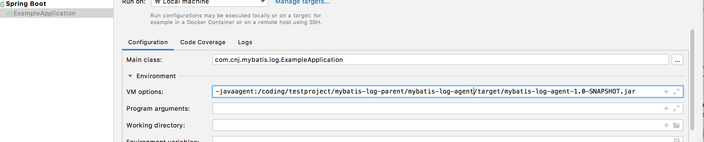
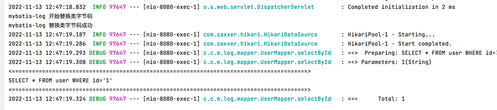

# mybatis-log
mybatis sql格式化工具
## 1.mybatis-log-agent 的使用方法

### 1.1 使用maven package打包成jar包

### 1.2 添加javaagent参数配置到应用程序启动的vm参数中
-javaagent:/coding/mybatis-log-parent/mybatis-log-agent/target/mybatis-log-agent-1.0-SNAPSHOT.jar

### 1.3 启动程序，查看效果

执行sql之后，就会打印出格式化好的sql了

