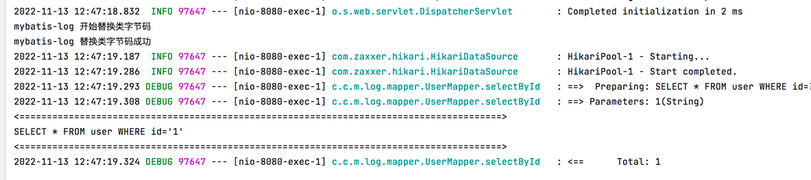
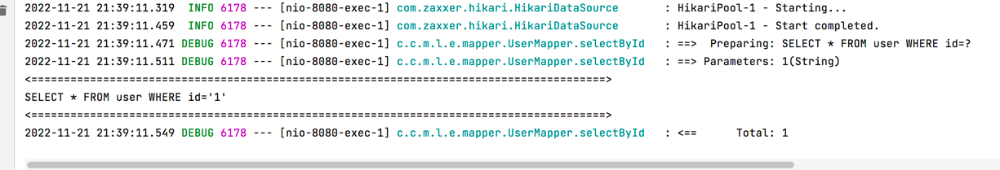

# mybatis-log

mybatis sql格式化工具

## 1.mybatis-log-agent 的使用方法

### 1.1 获取mybatis-log-agent.jar

直接下载打包好的mybatis-log-agent.jar或使用maven package将mybatis-log-agent打包成jar包

### 1.2 添加javaagent参数配置到应用程序启动的vm参数中

-javaagent:/coding/mybatis-log-parent/mybatis-log-agent/target/mybatis-log-agent-1.0-SNAPSHOT.jar


### 1.3 启动程序，查看效果

执行sql之后，就会打印出格式化好的sql了



## 2.mybatis-log-bytebuddy 的使用方法

### 1.1 获取mybatis-log-bytebuddy.jar

直接下载打包好的mybatis-log-bytebuddy.jar或使用maven package将mybatis-log-bytebuddy打包成jar包

### 1.2 在maven依赖中引入mybatis-log-bytebuddy

```xml
<dependency>
    <groupId>com.cnj.mybatis.log</groupId>
    <artifactId>mybatis-log-bytebuddy</artifactId>
    <version>1.0.1</version>
    <exclusions>
        <exclusion>
            <groupId>org.mybatis</groupId>
            <artifactId>mybatis</artifactId>
        </exclusion>
    </exclusions>
</dependency>
```
### 1.3 在程序主函数的首行的引入mybatis-log-bytebuddy

```java
public static void main(String[] args) {
    MybatisLogInstaller.install();
    SpringApplication.run(ExampleApplication.class, args);
}
```

### 1.4 启动程序，查看效果

执行sql之后，就会打印出格式化好的sql了


